# Replicating: "Load is not what you should balance: Introducing Prequal"

**Team Members:**  
Amirali Askari

---

**Source Paper:**  
Bartek Wydrowski, Robert Kleinberg, Stephen M. Rumble, and Aaron Archer:
"Load is not what you should balance: Introducing Prequal." arXiv:2312.10172v1,
2023.

**Project:**  
[https://github.com/amiraliaskari2014/loadbalancer-prequal.git](https://github.com/amiraliaskari2014/loadbalancer-prequal.git)

---

# 1. Introduction

Large distributed services usually run many replicas of the same backend job.
A load balancer must choose a replica for each request while the replicas are
affected by heterogeneous machine capacity, changing request cost, and load from
other colocated jobs. The paper argues that the intuitive objective, balancing
CPU utilization, can be the wrong target. If some machines have antagonist load,
then sending equal CPU load to all replicas can push a few replicas into
contention and produce high tail latency and deadline errors.

Prequal, short for Probing to Reduce Queuing and Latency, addresses this problem
by routing requests using current server-local signals rather than historical
CPU load alone. Each Prequal client maintains a small pool of recent probe
responses. A probe reports the backend's requests in flight (RIF) and a latency
estimate. The load balancer then applies a hot-cold lexicographic (HCL) rule:
avoid replicas whose RIF is above a configured quantile, and among the remaining
"cold" replicas choose the one with the best latency estimate. This makes RIF a
guardrail against overload while still allowing latency-based routing when it is
safe.

The paper's main contributions are:

- It shows that balancing CPU utilization is not always equivalent to minimizing
  request latency in multi-tenant datacenters.
- It proposes Prequal, an asynchronous probing load-balancing policy that uses
  server-local RIF and latency.
- It introduces the HCL replica-selection rule, which combines RIF and latency
  without a fragile linear weighting.
- It evaluates Prequal in YouTube production traffic and controlled testbed
  experiments, showing lower tail latency, lower error rate, and better
  tolerance of overload than weighted round robin (WRR).

Our project reproduces the core experimental ideas in a CloudLab environment
using a new Go implementation of the backend and load balancer. The project is
not the original Google artifact. Instead, it is a controlled reimplementation
that preserves the relevant mechanisms: server-local RIF, latency probes,
synthetic antagonist load, WRR as a baseline, and paper-style load ramps.

# 2. Selected Result

The primary result selected for reproduction is the paper's Figure 6, the load
ramp experiment. The paper increases aggregate request load from 75% to 174% of
the server job's allocation. Within each load level, the first half of the
window uses WRR and the second half uses Prequal. The result is important
because it directly supports the paper title: WRR balances CPU load tightly, but
it creates high tail latency and deadline errors after the job exceeds its CPU
allocation. Prequal permits a looser CPU distribution, but directs requests away
from replicas that appear overloaded and therefore keeps tail latency and errors
lower.

<center>
  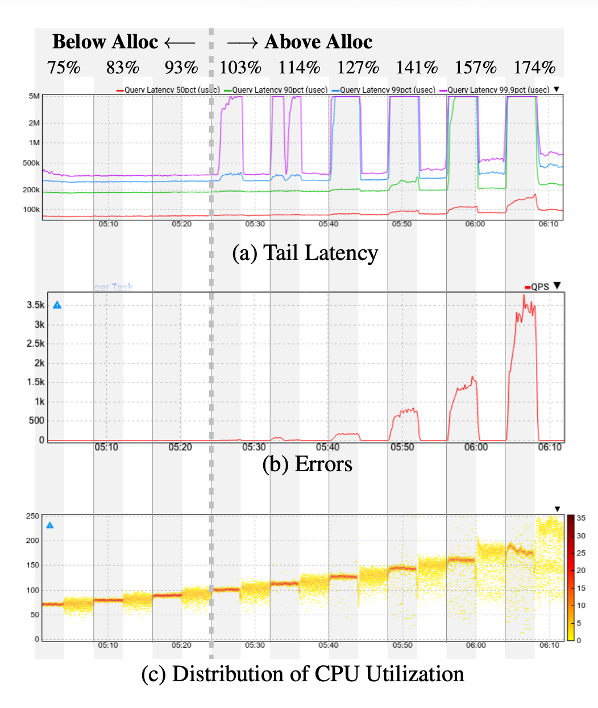
  <p><b>Figure 1:</b> Paper Figure 6, the load ramp experiment. Gray windows are WRR; white windows are Prequal. The paper uses a 5 second request deadline, so the latency plot tops out at 5,000,000 microseconds.</p>
</center>

We also attempted the two parameter studies from the paper's Figure 8 and
Figure 9. Figure 8 studies Prequal's probe rate. Figure 9 studies the QRIF
threshold that separates hot and cold replicas in the HCL rule. These two
figures help explain why Prequal works, while Figure 6 is the central
end-to-end comparison.

<center>
  <div style="display:inline-block; width:43%; vertical-align:top;">
    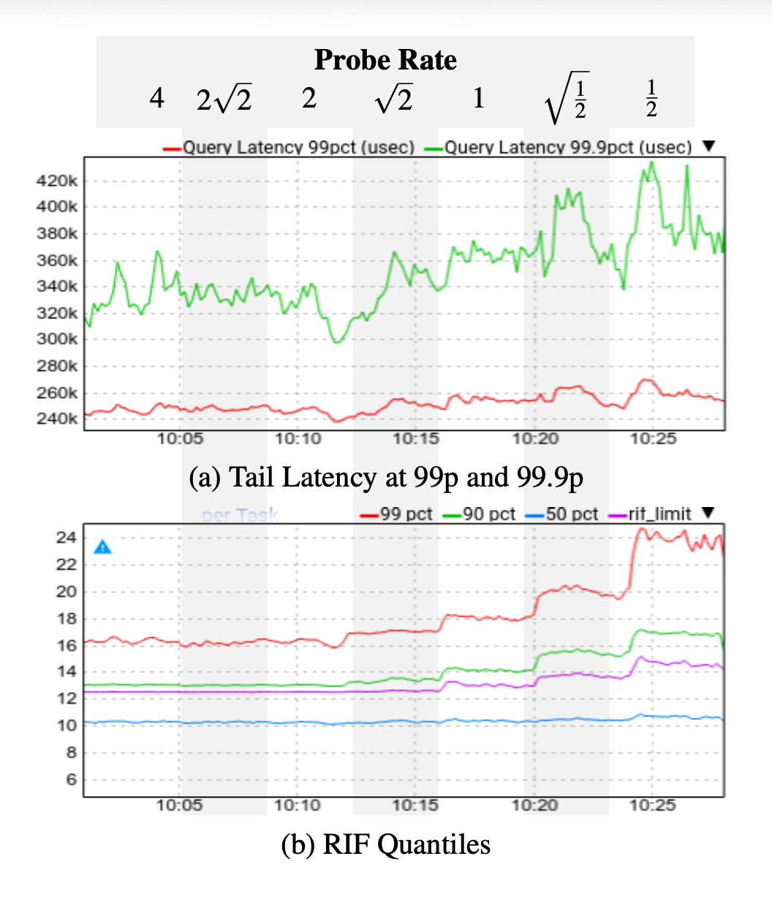
    <p><b>Figure 2:</b> Paper Figure 8, probe-rate sensitivity.</p>
  </div>
  <div style="display:inline-block; width:43%; padding-left:1em; vertical-align:top;">
    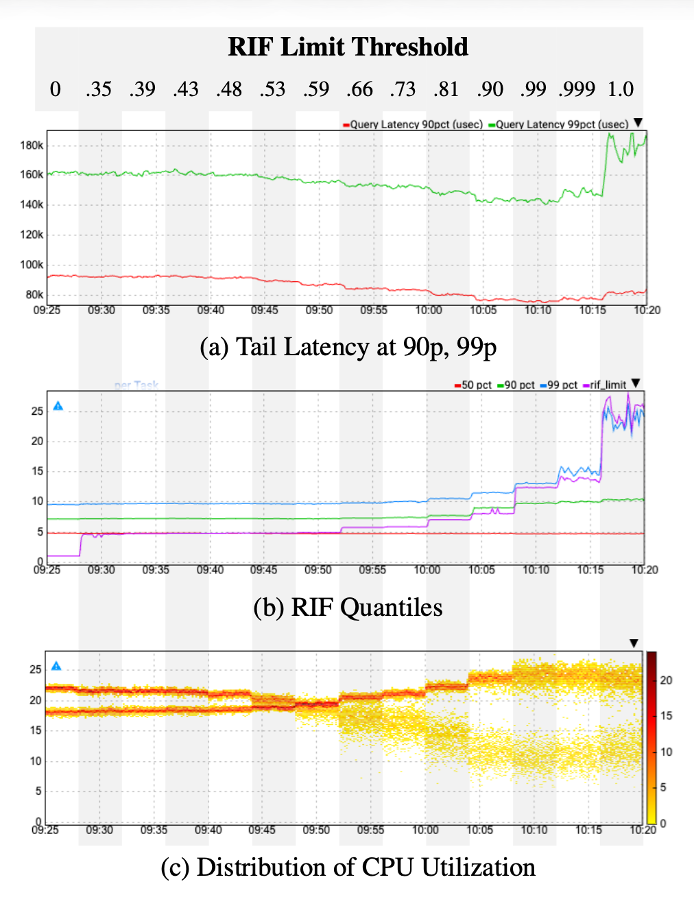
    <p><b>Figure 3:</b> Paper Figure 9, QRIF threshold sensitivity.</p>
  </div>
</center>

# 3. Environment Setup

## 3.1 Hardware Environment

The experiments ran on CloudLab/Emulab using a custom profile,
`experiments/cloudlab_profile.py`. The final profile provisions:

- 20 backend physical nodes named `bhost1` through `bhost20`
- 1 load-balancer node named `lb`
- 1 background-load node named `bgload`
- 1 monitor node named `monitor`
- A single LAN with static addresses `10.10.1.1` through `10.10.1.20` for the
  backend hosts, `10.10.1.254` for the load balancer, `10.10.1.253` for
  background load, and `10.10.1.252` for monitoring

The profile default hardware type is `d430`, but the profile exposes hardware
type as a parameter so an equivalent CloudLab node type such as `d710` can be
used if `d430` nodes are unavailable. The important design choice is one
physical backend host per measured server. Earlier versions packed many backend
containers onto fewer physical hosts, which made the environment much less
realistic because several "replicas" shared the same host-level bottleneck.

## 3.2 Software Environment

The CloudLab image is Ubuntu 22.04. The setup script installs Docker, Git, curl,
Go, Python 3, NumPy, Matplotlib, and the `hey` HTTP load generator. Docker
images are built on CloudLab from the project repository under `/opt/prequal`.

The project contains three main Go components:

- `backend/main.go`: a synthetic CPU-intensive HTTP backend that exposes
  `X-RIF`, `X-Latency-Estimate`, `X-CPU-Load`, and `X-Server-ID` headers.
- `cmd/balancer/main.go` and `pkg/loadbalancer`: the load balancer supporting
  Prequal, WRR, random, round robin, least-loaded, and LL-Po2C policies.
- `cmd/bgload/main.go`: a background requester that sends direct traffic to
  contended backend replicas, making antagonist load visible to probes but not
  to the balancer's own forwarding counters.

The experiment harness is in `experiments/`:

- `prepare.py` performs CloudLab setup, builds Docker images, starts containers,
  configures the load balancers, starts Prometheus/Grafana, and verifies
  backend health.
- `experiment1.py` and `experiment1.sh` run the Figure-6-style load ramp.
- `experiment1_scaling.sh` and `experiment1_scaling_plot.py` run the load ramp
  at 5, 10, and 20 backend scales and plot scaling-error behavior.
- `experiment2.py` and `experiment2.sh` run the probe-rate sweep.
- `experiment3.py` and `experiment3.sh` run the QRIF threshold sweep.
- `postprocess_smooth.py` builds smoothed 2xx-only latency plots.
- `postprocess_deadline.py` builds paper-style deadline plots by mapping
  non-2xx responses to a synthetic 5 second latency.

## 3.3 Configuration Parameters

The load-ramp experiments used the same load levels as the paper:

| Parameter | Value |
|---|---:|
| Load levels | 0.75, 0.83, 0.93, 1.03, 1.14, 1.27, 1.41, 1.57, 1.74 |
| Per-policy window | 240 seconds |
| Per-load total window | 480 seconds, WRR then Prequal |
| Measurement bin | 5 seconds |
| Per-server target QPS | 25 |
| Single 20-server target range | 375 QPS to 870 QPS |
| 20-server workers | 30 |
| 10-server workers | 15 |
| 5-server workers | 8 |
| Prequal QRIF default | 0.84 |
| Prequal probe rate default | 2 probes/query |

The backend setup interleaves clean and contended replicas. In `prepare.py`,
clean replicas use `CPU_LOAD=0` and `MAX_CONCURRENCY=20`; contended replicas use
`CPU_LOAD=60` and `MAX_CONCURRENCY=3`. The background-load service also sends
direct traffic to contended replicas. This combination creates replicas that are
reachable and healthy but have less headroom, approximating the antagonist-load
situation described in the paper.

## 3.4 Deviations from the Original Setup

The paper's controlled testbed uses 100 client replicas and 100 server replicas
in a Google datacenter. Each server replica is allocated 10% of a machine's CPU,
and antagonist load is real colocated production activity. Our reproduction is
smaller and uses CloudLab bare-metal nodes with Dockerized components.

The most important deviations are:

- Scale: our largest run uses 20 backend servers instead of 100.
- Client model: our experiments use `hey` from the `lb` node rather than 100
  client replicas.
- Antagonist load: our contention is synthetic and controlled by backend delay,
  bounded concurrency, and direct background traffic.
- Deadline semantics: the backend emits HTTP 503 overload responses instead of
  waiting for every failed request to hit a client-side 5 second timeout.
- WRR baseline: our `weightedrr` policy is the repository's simplified weighted
  baseline. It is not Google's production WRR, which uses smoothed goodput, CPU
  utilization, and error rate.
- CPU plots: our CPU panel samples host `/proc/stat`; it is therefore a
  host-level diagnostic, not the exact same allocation-normalized CPU metric
  used in Google's monitoring system.
- Artifact: the paper does not provide the production Prequal implementation.
  This project is a clean-room reproduction of the mechanism.

These deviations were necessary because the original environment depends on
Google's internal RPC system, production deployment infrastructure, and
datacenter monitoring stack. The CloudLab setup is smaller, but it captures the
mechanism we wanted to test: when some replicas are more contended than others,
does a Prequal-like policy avoid errors and high tail latency better than WRR?

# 4. Experiment Result

## 4.1 Implementation Changes Made for Reproduction

The original project began as a small Docker Compose demonstration. To turn it
into a reproducible CloudLab experiment, we added and modified several pieces.

First, we added a CloudLab profile that creates one physical backend node per
backend server. This matters because the paper's story depends on independent
server replicas with different machine-level antagonist load. Running many
containers on the same host hides that effect.

Second, we extended the backend so each request increments a server-local RIF
counter, passes through a bounded queue and concurrency semaphore, performs
small CPU work, and sleeps according to the synthetic `CPU_LOAD`. Overload is
reported as HTTP 503. The backend also records recent latency by arrival RIF,
which lets probes return a latency estimate similar in spirit to the paper's
server-local latency signal.

Third, we implemented Prequal's asynchronous probe pool and HCL rule in the
load balancer. The balancer keeps a bounded pool of probe entries, expires old
entries, removes old or bad entries, and routes to the lowest-latency cold
replica when possible. The WRR baseline is intentionally simpler than the
paper's Google WRR implementation. It uses repository-local weights rather than
production CPU/goodput/error feedback, and the experiment setup keeps those
weights stable during the ramp so the comparison is against a conservative
weighted routing baseline.

Fourth, we wrote the experiment harness. The scripts copy experiment code to
the CloudLab `lb` node, run preparation if needed, execute the experiment,
download all CSVs and plots automatically, and store local results under
`experiments/results/`. The scripts also generate `STATUS.json` and log files
so a run can be recovered after SSH disconnects.

Finally, we added post-processing. The raw measurement treats latency and errors
separately: latency percentiles are computed only over 2xx responses, while all
non-2xx responses appear in the error-QPS panel. This is the cleanest view of
what the HTTP system actually measured. For comparison with the paper, we also
generate deadline plots where every non-2xx response is mapped to 5,000,000
microseconds. This mirrors the paper's 5 second deadline behavior while keeping
the raw measurements intact.

## 4.2 Experiment 1: Load Ramp

The main run uses 20 servers, 30 `hey` workers, 25 QPS per server at 100% load,
9 load levels, and 4 minutes per policy window. Each load level runs WRR first
and Prequal second. The full 20-server load-ramp run takes about 75 minutes,
including warmup and plotting.

Correctness checks included:

1. `prepare.py` verified both load-balancer containers were running.
1. It verified all backend containers answered before measurement.
1. Each experiment performed a short `hey` self-test against both policies.
1. Raw CSVs were retained for every phase.
1. Status distributions were recorded so error plots could be traced to actual
   HTTP status codes.
1. Host CPU was sampled from each `bhost*` node every 5 seconds.

The paper's load-ramp figure shows extreme WRR deadline behavior: at high load,
WRR reaches the 5 second cap for p99 and p99.9, while Prequal keeps latency far
below the deadline and produces zero errors. Our reproduced 20-server result
shows the same direction but at a smaller magnitude. In the raw 2xx-only view,
Prequal has lower p99 and p99.9 latency at high load and almost no errors. In
the deadline-mapped view, WRR's non-2xx responses become visible as p99.9 spikes
because failed requests are assigned a 5 second latency.

<center>
  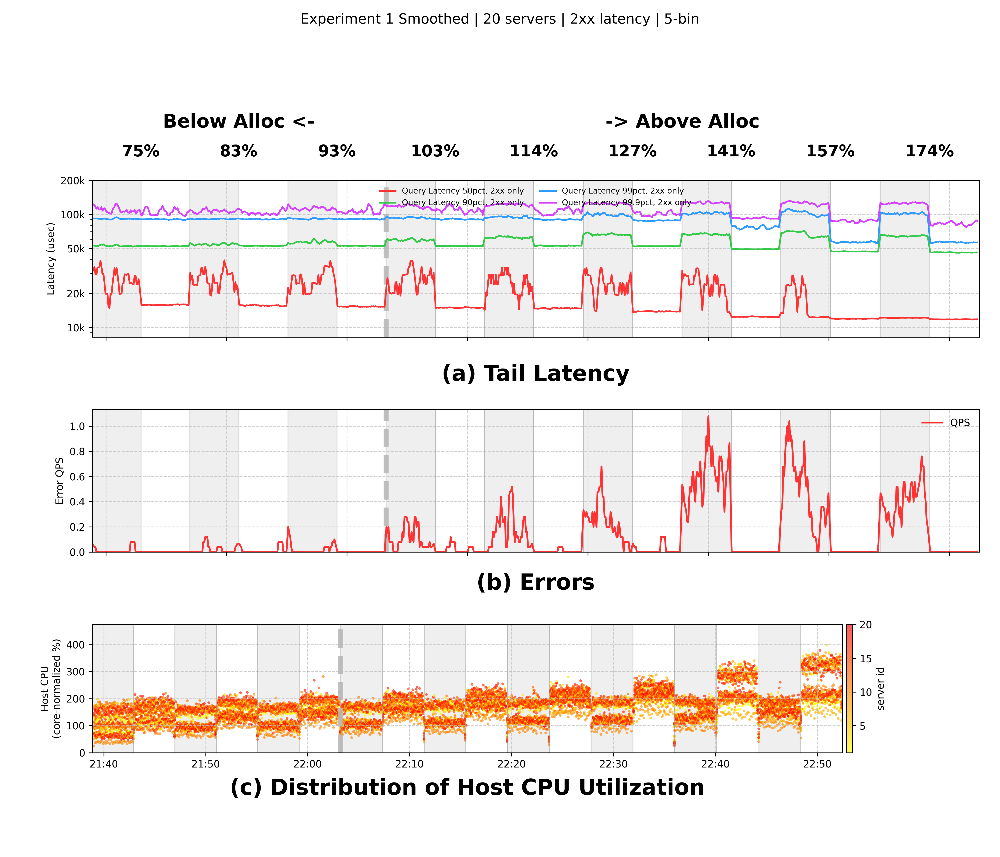
  <p><b>Figure 4:</b> Our 20-server load ramp using raw semantics: latency percentiles use only 2xx responses, and non-2xx responses remain in the error panel.</p>
</center>

<center>
  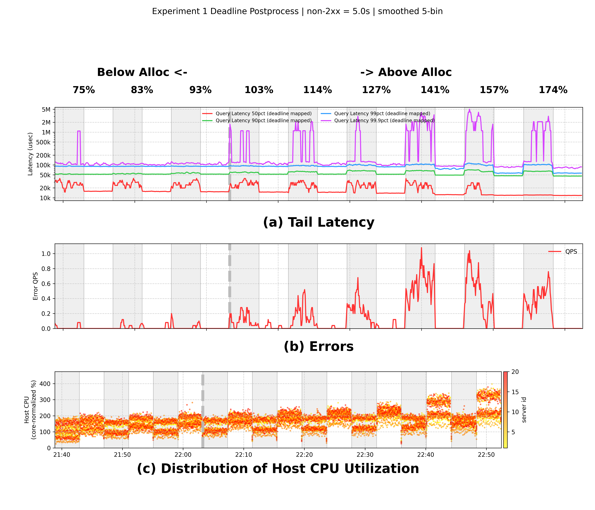
  <p><b>Figure 5:</b> Our 20-server load ramp with paper-style deadline post-processing. Non-2xx responses are mapped to 5 seconds before latency percentiles are recomputed.</p>
</center>

The numerical summary for the final scaling run is:

| Servers | Load | WRR p99.9 | Prequal p99.9 | WRR error QPS | Prequal error QPS |
|---:|---:|---:|---:|---:|---:|
| 5 | 157% | 118.9 ms | 17.0 ms | 0.0083 | 0.0000 |
| 5 | 174% | 114.5 ms | 16.8 ms | 0.0000 | 0.0000 |
| 10 | 157% | 123.5 ms | 17.8 ms | 0.0958 | 0.0000 |
| 10 | 174% | 120.9 ms | 17.9 ms | 0.0833 | 0.0000 |
| 20 | 157% | 127.7 ms | 87.2 ms | 0.4958 | 0.0000 |
| 20 | 174% | 125.7 ms | 83.8 ms | 0.4083 | 0.0000 |

At 20 servers, WRR accumulated 498 non-2xx responses over the load-ramp
windows, while Prequal accumulated 12. The error gap is much smaller than in the
paper because our backend emits quick 503 responses instead of holding failed
queries until a real 5 second deadline, and because the experiment is scaled
down from 100 servers to 20. Still, the qualitative result matches the paper:
Prequal trades perfect CPU balancing for better routing around contended
replicas, reducing errors and high-percentile latency.

## 4.3 Debugging and Measurement Choices

Several issues affected early measurements and were corrected before producing
the final figures.

The first issue was topology realism. When several backend containers ran on
the same physical host, failures and CPU pressure were dominated by container
packing rather than independent replica selection. We replaced that setup with
`cloudlab_profile.py`, which assigns one backend node per server.

The second issue was load generation. Using the same worker count for 5, 10,
and 20 servers would make smaller scales artificially bursty. The scaling
runner therefore uses `WORKERS_BY_COUNT="5:8 10:15 20:30"` by default. This
keeps the worker count approximately proportional to the request rate.

The third issue was latency accounting. Counting 503 responses directly as
normal latency polluted the latency plot and hid the distinction between slow
successes and explicit errors. The final scripts compute raw latency only over
2xx responses and keep every non-2xx response in the error plot. The separate
deadline post-processor exists only for paper-style visualization.

The fourth issue was CPU visualization. Early plots used the backend's
synthetic `CPU_LOAD` label, which is a configuration parameter rather than a
real measurement. The final CPU panel samples host `/proc/stat` from each
backend node and plots the measured host CPU distribution. Because the metric is
host-level and core-normalized, its absolute scale is not identical to the
paper's allocation-normalized CPU, but it is useful for checking that load is
changing over time and differs across hosts.

## 4.4 Experiment 2: Probe-Rate Sweep

The paper's Figure 8 reduces the probe rate from 4 probes/query to 1/2
probe/query while running at roughly 1.5x allocation. It finds that Prequal is
fairly insensitive to probe rate until the rate drops below about 1
probe/query, after which RIF and tail latency increase.

Our Experiment 2 uses the same seven nominal probe-rate states, each for 240
seconds, at 1.5x load on 20 servers. The generated plot is:

<center>
  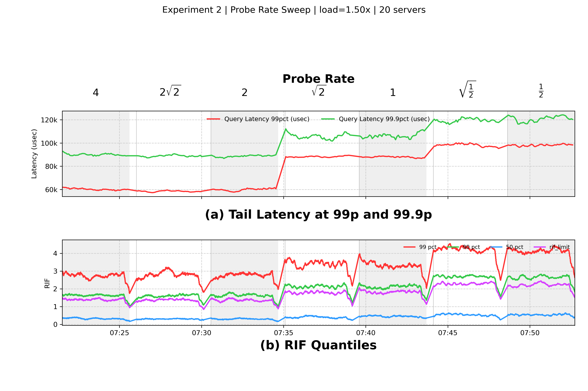
  <p><b>Figure 6:</b> Our probe-rate sweep at 20 servers and 1.5x load.</p>
</center>

The result partially matches the paper. At nominal rates of 4, 2sqrt(2), and 2,
p99 latency remains around 58-60 ms and p99.9 around 89-90 ms with no errors.
At nominal rate sqrt(2) and 1, p99 rises to about 88 ms and p99.9 rises to
about 104-105 ms. At nominal rates below 1, p99 approaches 98 ms, p99.9 reaches
about 122 ms, and errors increase.

| Nominal probe rate | Effective async probes/query | p99 | p99.9 | Errors |
|---:|---:|---:|---:|---:|
| 4 | 4 | 60.0 ms | 90.2 ms | 0 |
| 2sqrt(2) | 2 | 58.3 ms | 88.8 ms | 0 |
| 2 | 2 | 59.6 ms | 88.9 ms | 0 |
| sqrt(2) | 1 | 88.3 ms | 105.1 ms | 14 |
| 1 | 1 | 87.9 ms | 104.1 ms | 11 |
| sqrt(1/2) | 0 | 98.2 ms | 121.6 ms | 59 |
| 1/2 | 0 | 97.9 ms | 122.2 ms | 87 |

There is one important limitation. The current balancer accepts `LB_PROBE_RATE`
as a float, but `triggerAsyncProbes()` converts it to `int(rate)`. Therefore
the two fractional rates below 1 produce zero per-query async probes, although
the periodic background prober still runs. This means our Experiment 2 is a
useful sensitivity test for this implementation, but it is not an exact
fractional-probing reproduction of the paper.

## 4.5 Experiment 3: RIF Limit Threshold Sweep

The paper's Figure 9 varies QRIF from 0 to 1.0 while introducing heterogeneous
fast and slow replicas. As QRIF rises, the HCL rule shifts from RIF-heavy
control toward latency-heavy control. The paper shows that latency improves as
the system uses more latency information, but pure latency control becomes
unstable because it ignores RIF as a leading signal.

Our Experiment 3 uses the same QRIF sequence on 20 servers at 0.75x load:
0, .35, .39, .43, .48, .53, .59, .66, .73, .81, .90, .99, .999, and 1.0.
Each phase runs for 240 seconds. The implementation also works around a local
configuration edge case: exact `LB_QRIF=0` is treated as an unset default in the
balancer constructor, so the experiment runs the zero point as `1e-9`.

<center>
  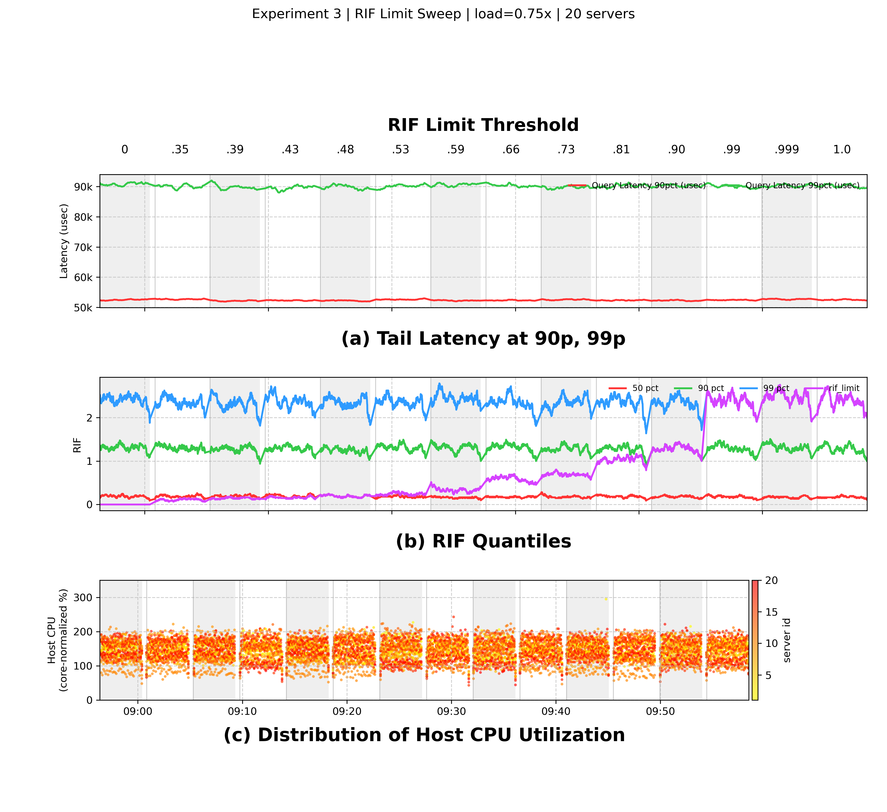
  <p><b>Figure 7:</b> Our QRIF threshold sweep at 20 servers and 0.75x load.</p>
</center>

This run does not reproduce the paper's strong QRIF tradeoff. Our p90 remains
near 52 ms, p99 near 90 ms, and p99.9 near 99-102 ms across the entire sweep.
The likely reason is that our reproduction does not include the paper's
fast/slow-replica workload for this experiment. The paper artificially makes
half the replicas 2x slower, creating a meaningful latency-vs-RIF routing
tradeoff. Our current backend has clean and contended replicas, but not a
controlled 2x fast/slow split for Experiment 3. Therefore this figure validates
the QRIF sweep harness and RIF instrumentation, but it should not be interpreted
as a successful reproduction of the paper's Figure 9 trend.

# 5. Further Exploration

The additional research question we explored is: how does the WRR-vs-Prequal
error gap change when the experiment is scaled from 5 to 10 to 20 backend
servers in the same CloudLab profile?

This is not a figure from the paper, but it is directly motivated by the
paper's scale. The original testbed uses 100 server replicas. We could not run
100 physical CloudLab backend nodes, so we used 5, 10, and 20 as a scaled-down
series. Each run uses the same load fractions and per-server QPS. The total
request rate therefore grows with the number of servers. The worker count also
scales with the number of servers to avoid making small runs artificially
bursty.

## 5.1 Methodology and Result

The scaling runner performs:

1. One CloudLab preparation over 20 backend nodes.
1. A 5-server load ramp using the first 5 healthy backends and 8 workers.
1. A 10-server load ramp using the first 10 healthy backends and 15 workers.
1. A 20-server load ramp using all 20 healthy backends and 30 workers.
1. Local post-processing to generate per-scale plots and aggregate error plots.

The per-scale raw and deadline-smoothed plots are shown below.

<center>
  <div style="display:inline-block; width:30%; vertical-align:top;">
    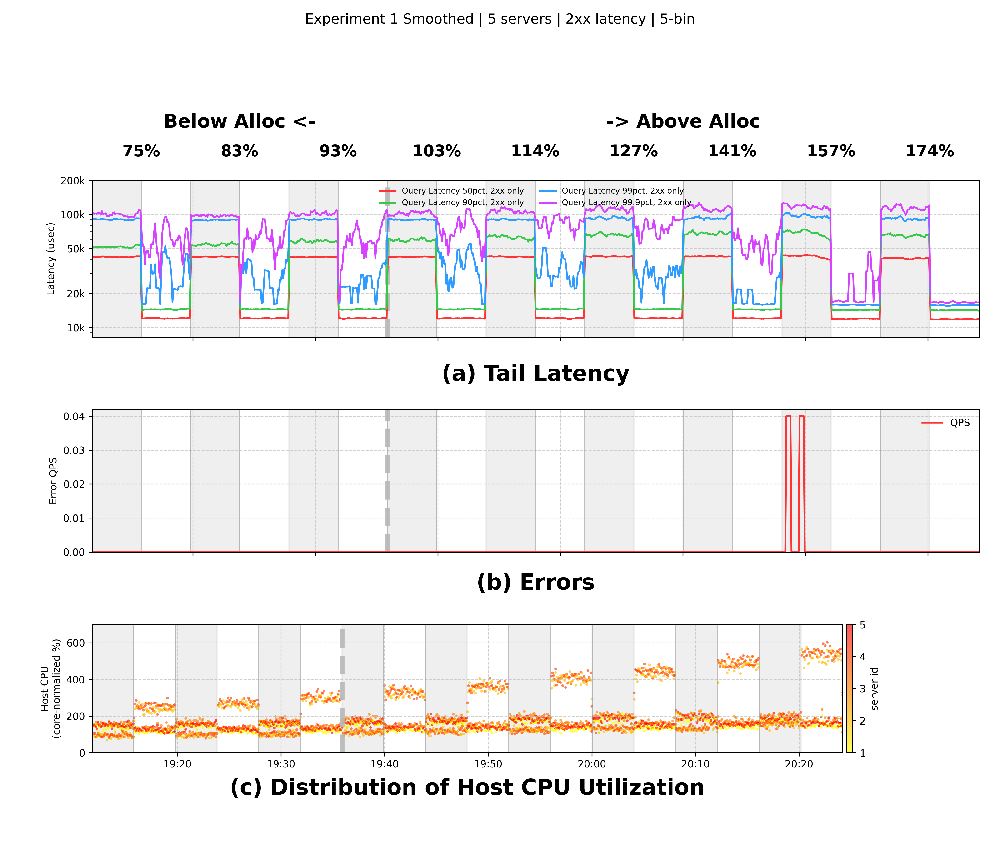
    <p><b>Figure 8:</b> 5-server raw semantics.</p>
  </div>
  <div style="display:inline-block; width:30%; padding-left:1em; vertical-align:top;">
    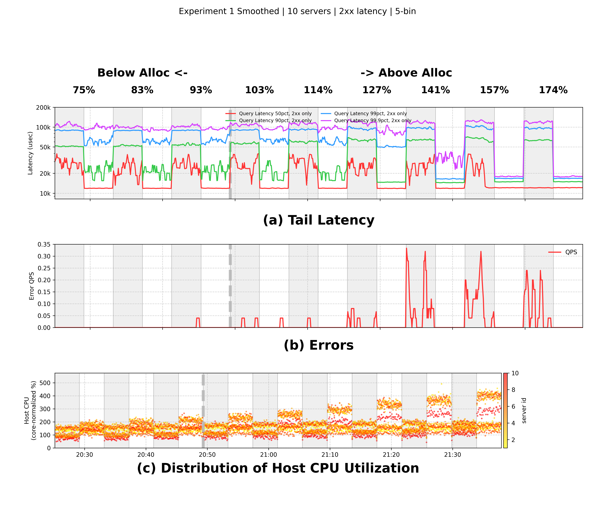
    <p><b>Figure 9:</b> 10-server raw semantics.</p>
  </div>
  <div style="display:inline-block; width:30%; padding-left:1em; vertical-align:top;">
    
    <p><b>Figure 10:</b> 20-server raw semantics.</p>
  </div>
</center>

<center>
  <div style="display:inline-block; width:30%; vertical-align:top;">
    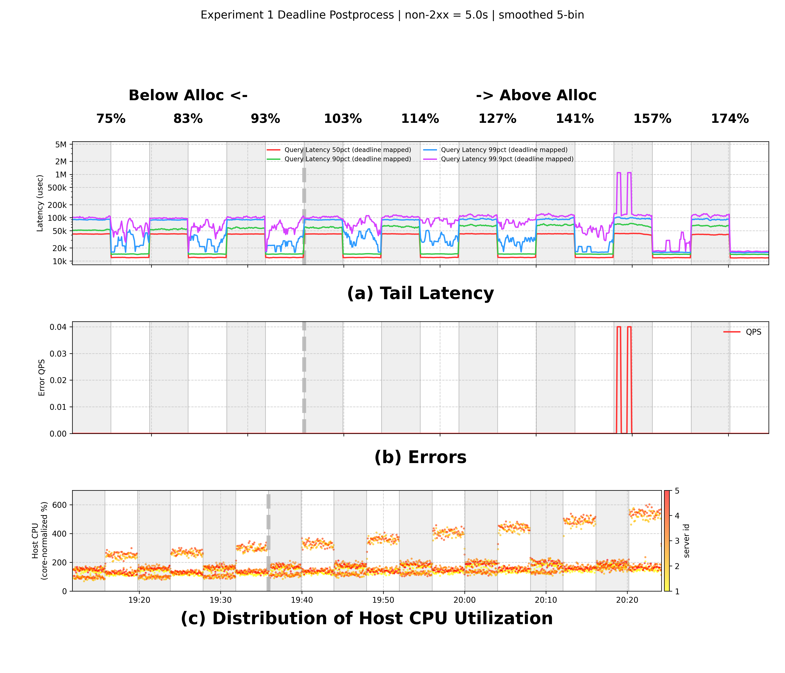
    <p><b>Figure 11:</b> 5-server deadline post-processing.</p>
  </div>
  <div style="display:inline-block; width:30%; padding-left:1em; vertical-align:top;">
    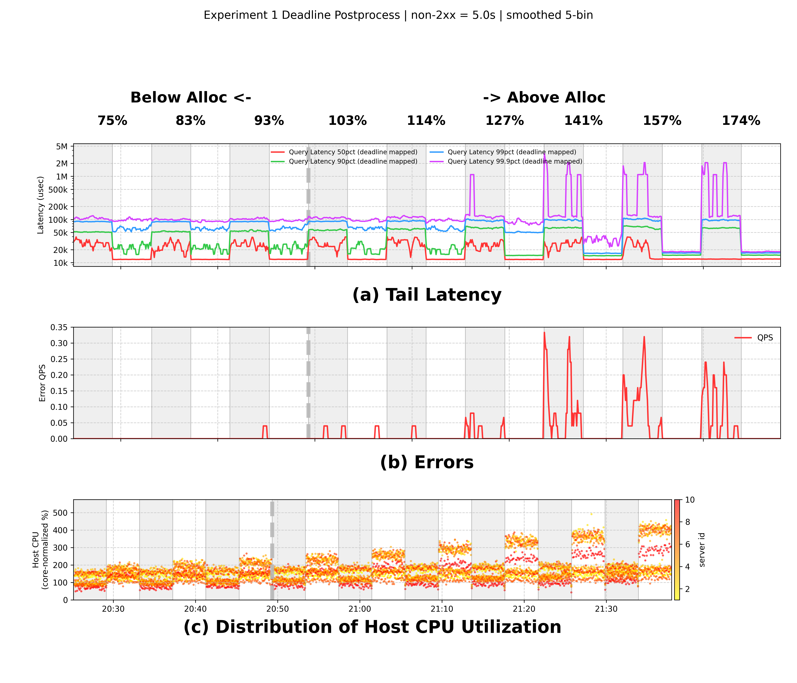
    <p><b>Figure 12:</b> 10-server deadline post-processing.</p>
  </div>
  <div style="display:inline-block; width:30%; padding-left:1em; vertical-align:top;">
    
    <p><b>Figure 13:</b> 20-server deadline post-processing.</p>
  </div>
</center>

The aggregated error plots show a clear scaling effect. WRR errors grow much
faster than Prequal errors as the system scales up. Prequal is not perfectly
error-free in the 20-server aggregate, but the difference is large: 498 WRR
non-2xx responses versus 12 Prequal non-2xx responses.

<center>
  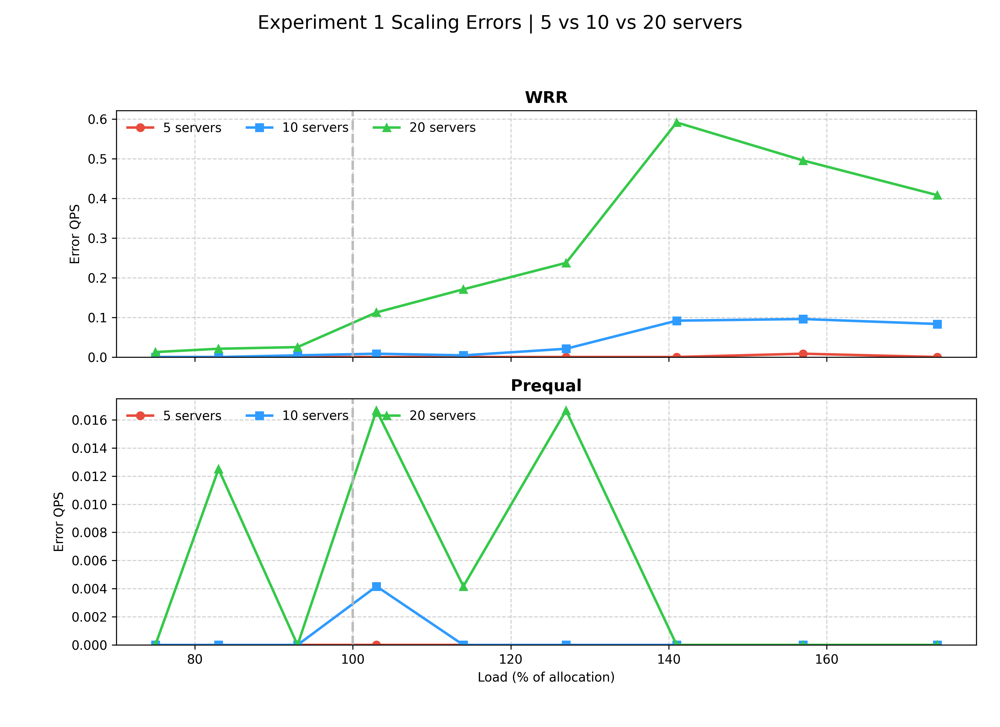
  <p><b>Figure 14:</b> Error QPS by load level for 5, 10, and 20 servers.</p>
</center>

<center>
  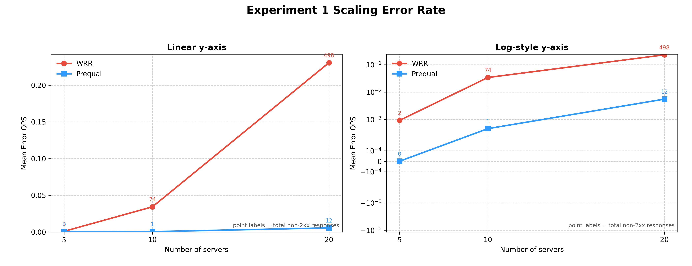
  <p><b>Figure 15:</b> Mean error QPS versus number of servers. Point labels show total non-2xx responses.</p>
</center>

| Servers | Policy | Total responses | Non-2xx responses | Mean error QPS | Overall error rate |
|---:|---|---:|---:|---:|---:|
| 5 | WRR | 306,345 | 2 | 0.00093 | 0.00065% |
| 5 | Prequal | 320,123 | 0 | 0.00000 | 0.00000% |
| 10 | WRR | 608,950 | 74 | 0.03426 | 0.01215% |
| 10 | Prequal | 640,246 | 1 | 0.00046 | 0.00016% |
| 20 | WRR | 1,213,147 | 498 | 0.23056 | 0.04105% |
| 20 | Prequal | 1,276,911 | 12 | 0.00556 | 0.00094% |

The main lesson is that the error advantage becomes easier to observe at larger
scale. With only 5 servers, the system has fewer choices and fewer total
requests, so both policies produce almost no errors. At 20 servers, Prequal has
more opportunities to use probe information to avoid contended replicas, while
WRR continues to send traffic according to smoothed weights and accumulates
more 503 responses under high load.

# 6. Reproducibility Assessment of the Paper

The paper is strong conceptually, but not fully reproducible from the text
alone. It clearly explains the main ideas, parameters, and experimental trends:
the load levels in Figure 6, the probe-rate values in Figure 8, the QRIF values
in Figure 9, the 100-client/100-server testbed, the 5 second deadline, and the
allocation-normalized CPU interpretation. These details were enough to design a
faithful scaled-down experiment.

However, several key details depend on Google's internal infrastructure and are
not available externally:

- The production Prequal implementation is inside Google's Stubby/gRPC
  infrastructure and is not released with the paper.
- The YouTube production deployment and antagonist load are not reproducible.
- The exact CPU isolation and allocation behavior of the Google datacenter is
  not available in CloudLab.
- The paper's monitoring and histogram pipeline affects how RIF and CPU
  quantiles are visualized.
- The Figure 9 fast/slow replica setup is described in the paper, but our
  project would need an additional backend feature to reproduce it exactly.

As a result, the most reproducible part of the paper is the mechanism and the
shape of the controlled experiments, not the absolute numbers. Our project
reproduces the central direction of Figure 6: Prequal reduces errors and tail
latency under overload compared with WRR. It also reproduces the probe-rate
insight qualitatively, with the caveat that our current implementation truncates
fractional probe rates. It does not reproduce Figure 9's latency-vs-RIF
crossover because our backend does not yet implement the paper's 2x fast/slow
replica split for that experiment.

# 7. Conclusion

This project confirms the paper's core claim in a scaled-down CloudLab setting:
the useful objective is not perfectly balanced CPU load, but routing requests to
replicas with available capacity. In our 20-server load ramp, WRR produces far
more non-2xx responses than Prequal, especially above allocation. Prequal's
advantage is also visible in p99 and p99.9 latency, especially in the
deadline-mapped plots that approximate the paper's 5 second timeout semantics.

The implementation work was as important as the final plots. We moved from a
small Docker Compose demo to a CloudLab profile with one physical node per
backend, added an idempotent preparation script, implemented realistic
server-local RIF and synthetic contention, separated latency and error
accounting, added deadline post-processing, fixed CPU plotting to use real host
measurements, and added a scaling experiment across 5, 10, and 20 servers.

The final results should be read as a rigorous scaled reproduction, not an
exact clone of Google's testbed. The absolute latency and error values differ
from the paper because our backend, workload, client model, and datacenter are
different. The qualitative conclusion is nevertheless consistent: using fresh
server-local signals lets Prequal avoid overloaded replicas better than WRR,
and that advantage grows as the system scales.

---

# Appendix: Reproduction Commands

From the project root:

```bash
cd /Users/gary/Downloads/loadbalancer-prequal/experiments

export SSH_OPTS="-A -o ForwardAgent=yes -o IdentitiesOnly=yes -i $HOME/.ssh/cloudlab_ed25519 -o ServerAliveInterval=30 -o ServerAliveCountMax=20 -o StrictHostKeyChecking=accept-new"
```

Run the main 20-server load ramp:

```bash
bash experiment1.sh Mr_Gary@<lb-host>
```

Run the 5/10/20-server scaling experiment:

```bash
bash experiment1_scaling.sh Mr_Gary@<lb-host>
```

Run the probe-rate sweep:

```bash
bash experiment2.sh Mr_Gary@<lb-host>
```

Run the QRIF threshold sweep:

```bash
bash experiment3.sh Mr_Gary@<lb-host>
```

If the CloudLab nodes have already been prepared and containers are still
running, add `SKIP_PREPARE=1` before a command. After rebooting nodes, run
without `SKIP_PREPARE=1` so Docker containers and monitoring are recreated.

Post-processing for Experiment 1 run directories:

```bash
python3 postprocess_smooth.py <run_dir> --smooth-bins 5
python3 postprocess_deadline.py <run_dir> --deadline-us 5000000 --smooth-bins 5
```

All final local result folders are under:

```text
/Users/gary/Downloads/loadbalancer-prequal/experiments/results/
```
